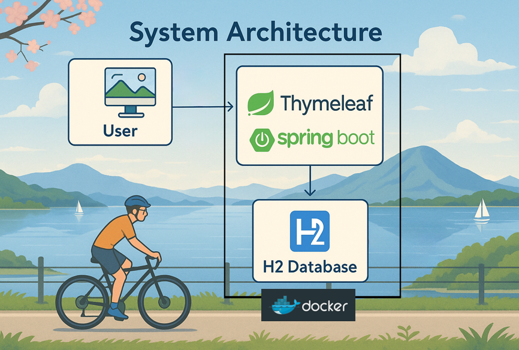

# techscrap

技術ブログ記事をスクラップするWebアプリ。

記事レコメンド機能を実装している。

## Overview



## Usage

DBのユーザー名とパスワードを環境変数として`.env`で用意する。

### `.env`

```
export DB_USERNAME=username
export DB_PASSWORD=password
```

アプリの起動。

```
docker-compose up -d --build
```